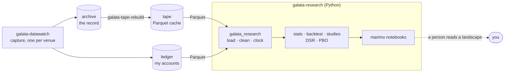
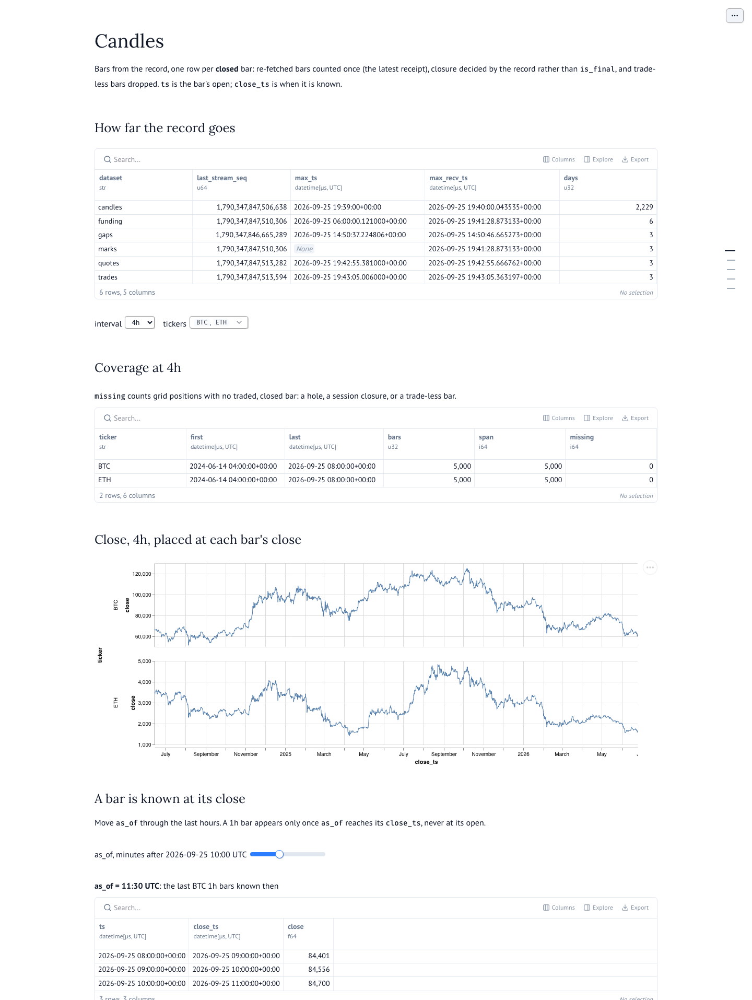
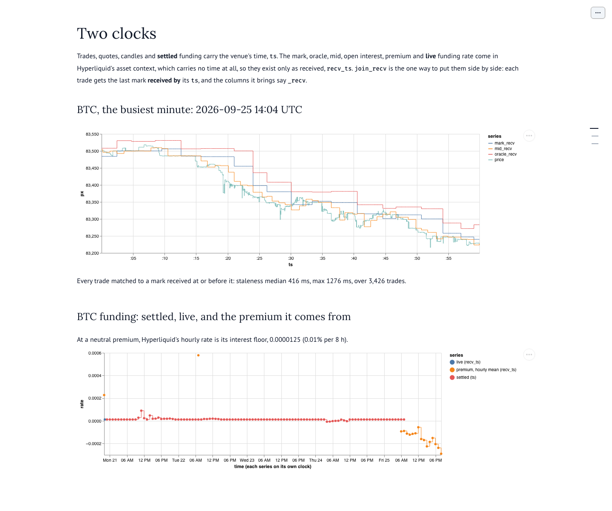
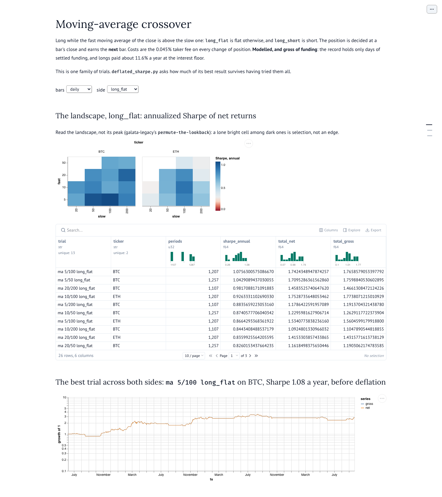
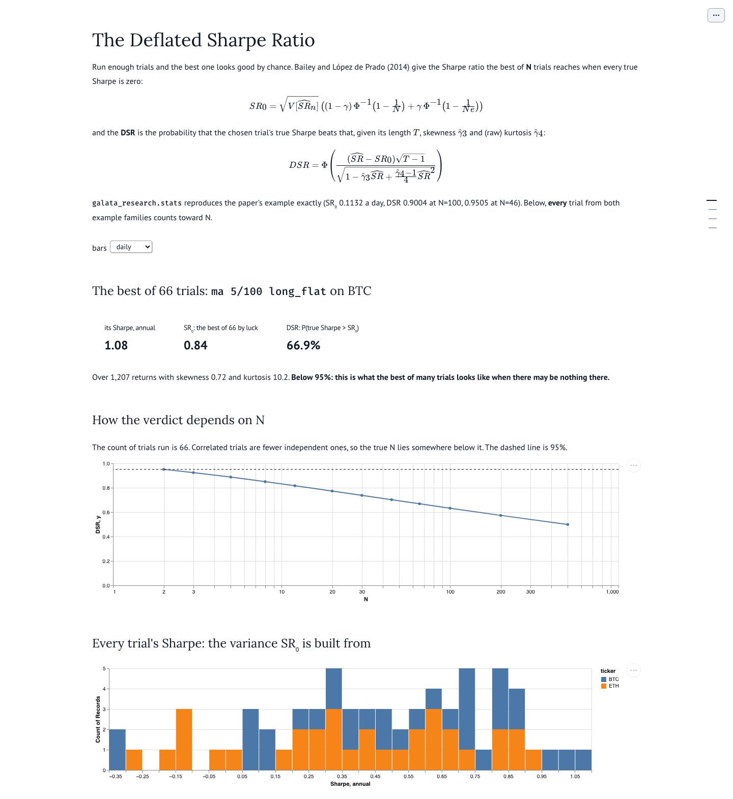
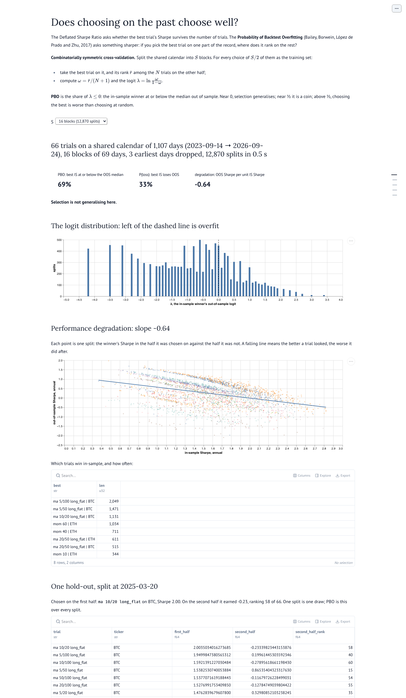
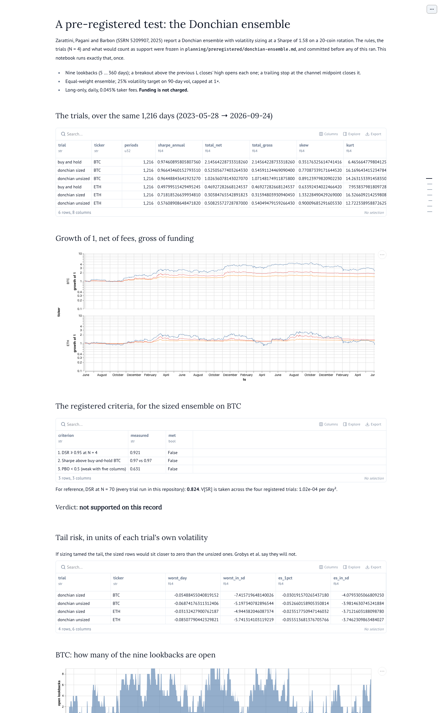
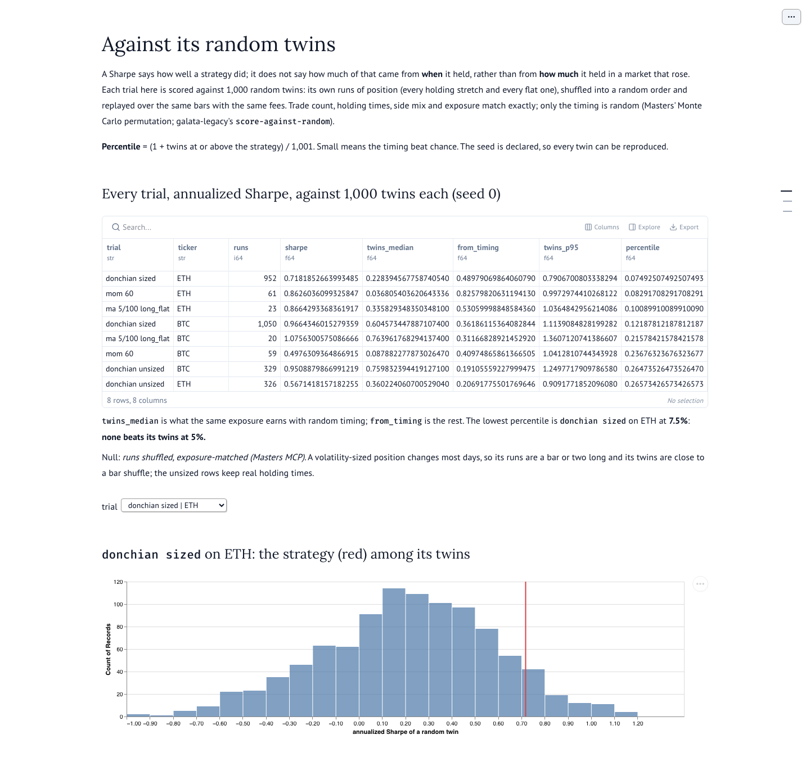
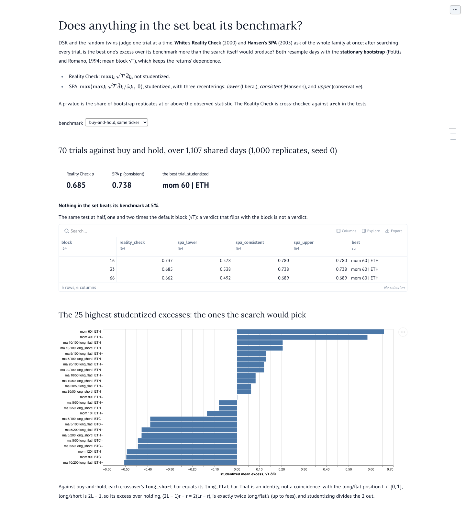
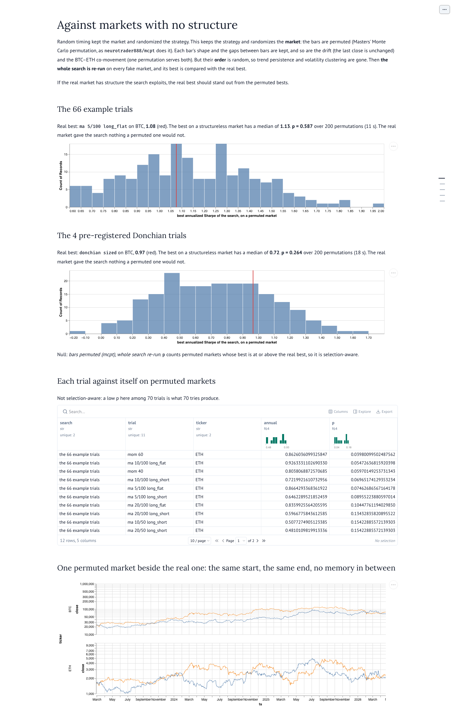

<picture>
  <source media="(prefers-color-scheme: dark)" srcset="assets/logo-on-dark.svg">
  
</picture>

# galata-research

[](https://github.com/sercanatalik/galata-research/actions/workflows/check.yml)
[](LICENSE-MIT)
[](pyproject.toml)
[](https://pola.rs)
[](https://marimo.io)

**Galata's research environment: the record galata-datawatch keeps, loaded as
polars or DuckDB with its semantics applied once, and studied in marimo
notebooks that say how much of a result survives.**

galata-research reads what
[galata-datawatch](https://github.com/sercanatalik/galata-datawatch) has
captured: candles, trades, quotes, marks, funding, gaps, and my own account's
margin snapshots. It hands them over deduplicated, on the right clock, and
with every gap marked. It never captures, never talks to a venue, and never
writes a configuration. A research result reaches a live system only through
a person.

> **Status: 0.x.** The market data loads on both clocks, gaps mark it, my
> margin snapshots decode, and the statistics that judge a backtest (the
> Deflated Sharpe Ratio and the Probability of Backtest Overfitting) are
> pinned to their papers' own examples. Fills follow once the account trades.

---

## Contents

- [Where it fits in Galata](#where-it-fits-in-galata)
- [Features](#features)
- [Screenshots](#screenshots)
- [Quick start](#quick-start)
- [The library](#the-library)
- [Two clocks](#two-clocks)
- [Studies](#studies)
- [Architecture](#architecture)
- [Development](#development)
- [Roadmap](#roadmap)
- [Related repositories](#related-repositories)
- [Licence](#licence)

---

## Where it fits in Galata

Galata is a low-latency algorithmic trading framework in Rust. It covers
multi-venue market data capture, signal generation, deterministic portfolio
risk controls, and agentic strategy execution driven by a fine-tuned decision
model. Research is the second layer. It comes **before** the trading half,
because three earlier rewrites built trading first and deferred research, and
two of them never got back to it.



| It reads | Through | Never |
|---|---|---|
| the tape | Parquet, with partition listings and footer statistics | parses the archive, or writes to the record |
| the ledger | the verbatim `clearinghouseState` answers, decoded strictly | fetches from a venue, or reads an address |
| the frontier | segment filenames and footers | scans a dataset to say how far it goes |

The full framework architecture and roadmap are in the
[galata-datawatch README](https://github.com/sercanatalik/galata-datawatch#galata-at-a-glance).

---

## Features

- **One row per event.** Re-fetched candles (about three rows per 1h bar on
  the tape) keep their latest receipt. Replayed trades (2.75% of rows, resent
  17 s to 708 s after a reconnect) keep their first.
- **Closure by the record.** A bar is closed when a later bar exists or it was
  received after its close. The venue's `is_final` flag is not trusted: the
  history walk stamps the still-forming bar final.
- **No lookahead.** A candle is known at `close_ts`, not at its open, and
  `as_of` filters on that. A backtest position decided at a close earns the
  next bar. Each guard has a test that fails when the guard is removed.
- **Exact time, and its absence stated.** `ts` is the venue's own time (whole
  milliseconds on Hyperliquid). Marks and live funding carry none, so they
  are on `recv_ts` only, and `join_recv` is the one way across.
- **Gaps marked, never filled.** `mask_gaps` adds `in_gap` and `gap_cause`. A
  bar the venue restated after an outage is whole, and is not marked.
- **My account.** Margin and positions per snapshot per dex, on the venue's
  clock, decoded strictly: an undocumented shape is refused by its path.
- **Statistics that are checked against their papers.** The Deflated Sharpe
  Ratio reproduces Bailey and López de Prado's example (0.9004), and PBO by
  CSCV follows Bailey, Borwein, López de Prado and Zhu step for step.
- **Refusal by name.** An unknown ticker, a naive datetime, a missing root or
  an old schema is refused with what exists, never answered with an empty
  frame.
- **polars by default, DuckDB on request.** The rules exist once, in polars
  expressions. `engine="duckdb"` runs DuckDB over their output.

---

## Screenshots

The marimo notebooks, run on the record as it stood on 2026-09-25.

**Candles.** How far each dataset goes, coverage per ticker, closes placed at
each bar's close, and an `as_of` slider where a bar appears only once it has
closed.



**Two clocks.** Every BTC trade in the busiest minute, with the mark, oracle
and mid received by its time, and funding settled, live and at its premium,
each on its own clock and broken where capture was down.



**Moving-average crossover.** A Sharpe landscape across fast × slow, and the
best trial's growth, gross and net of fees.



**The Deflated Sharpe Ratio.** The best of 66 trials against what luck would
give, and how the verdict moves with N.



**Overfitting.** PBO over 12,870 splits, the logit distribution, performance
degradation, and one hold-out.



**A pre-registered test.** The Donchian ensemble run once against the criteria
frozen before it: the trials, growth, the verdict and the tails.



**Against its random twins.** Each trial's own runs of position shuffled into
1,000 random orders over the same bars: how much of a Sharpe is timing, and
how much is just being long.



**The whole set.** White's Reality Check and Hansen's SPA over all 70 trials,
at three block lengths, and the trials a search would pick.



**Against markets with no structure.** The bars permuted as mcpt permutes
them (each bar's shape kept, their order random), and the whole search re-run
on each: the real best against the permuted bests.



---

## Quick start

```bash
git clone https://github.com/sercanatalik/galata-research
cd galata-research
uv sync
uv run pytest                          # fixture tapes, plus the real record when found
uv run marimo edit notebooks/candles.py
```

The record is found at `GALATA_VAR`, else `var_root` in
`./galata-research.toml`, else `../galata-datawatch/var`, the layout a
checkout beside galata-datawatch already has.

```python
import galata_research as gr

bars = gr.market.candles(["BTC", "ETH"], "4h", "2026-01-01T00:00Z", "2026-09-01T00:00Z")
bars.collect()                          # a polars LazyFrame, collected
gr.frontier()                           # how far each dataset is durable
```

---

## The library

| Call | Returns | The rule it owns |
|---|---|---|
| `gr.market.candles(tickers, interval, start, end, *, as_of, traded_only, closed_only)` | bars on `ts`, with `close_ts` | latest receipt per bar; closure by the record; `as_of` on `close_ts`; trade-less bars dropped |
| `gr.market.trades(tickers, start, end, *, as_of)` | executions on `ts` | first receipt per `(venue, ticker, trade_id)`; the venue's order within a message |
| `gr.market.quotes(tickers, start, end, *, as_of)` | top of book on `ts` | as received |
| `gr.market.funding(tickers, start, end, *, as_of)` | settled funding on `ts` | only the rows the venue timed |
| `gr.market.funding_live(...)`, `gr.market.marks(...)` | the predicted rate; mark, oracle, mid, OI, premium | on `recv_ts` only; `collapse=True` on request |
| `gr.market.gaps(tickers, start, end, *, series)` | gap events on the receipt clock | `from_recv_ts`, `to_recv_ts`, no `ts` |
| `gr.mask_gaps(frame, dataset, *, margin="1s")` | the frame plus `in_gap`, `gap_cause` | a tick inside `[from − margin, to)`; a bar overlapping and not restated |
| `gr.join_recv(left, right, *, tolerance="5s")` | `left` plus `<c>_recv`, `matched_recv_ts` | backward only, bounded, named |
| `gr.account.margin(...)`, `gr.account.positions(...)` | my snapshots per dex | venue time; `equity_held` false on a unified account |
| `gr.frontier()` | one row per dataset | from names and footers, no scan |

Every loader returns a `pl.LazyFrame`, or a DuckDB relation with
`engine="duckdb"`. Prices are `Float64` from the tape's `DECIMAL(38,18)`.

---

## Two clocks

| | Venue time, `ts` | Receipt time, `recv_ts` |
|---|---|---|
| **what it is** | when the venue says it happened | when capture received it |
| **on it** | candles (`close_ts` too), trades, quotes, settled funding | marks (mark, oracle, mid, OI, premium), the live funding rate, gap bounds |
| **why** | the venue stamps these | Hyperliquid's asset context carries no time at all |
| **never** | filled from receipt | joined to `ts` except through `join_recv` |

`join_recv` gives each venue-timed row the last value received by its `ts`.
Over the busiest BTC minute, 3,426 trades matched with a median staleness of
416 ms, and none matched forward.

---

## Studies

`gr.stats` (Sharpe, PSR, the expected maximum Sharpe, DSR, PBO, the permutation percentile, the stationary bootstrap with a Politis–White block, the Reality Check and SPA),
`gr.backtest.returns` (next-bar, fees on turnover, holes not spanned,
`modelled` on every row; settled funding charged on every hour held when
`funding=gr.market.funding(...)` is passed, and `funding_charged` says where
it was) and `gr.studies` (trial families that return every
trial, so N is the true N) back these notebooks:

| Notebook | Asks |
|---|---|
| `candles.py`, `ticks.py`, `gaps.py`, `clocks.py`, `account.py` | what the record holds, and how the loaders read it |
| `moving_average.py`, `momentum.py` | a Sharpe landscape for two example families |
| `deflated_sharpe.py` | does the best of 66 trials beat what luck would give? DSR 0.67 daily: **no** |
| `overfitting.py` | does choosing on the past choose well? PBO 0.69 over 12,870 splits: **no** |
| `donchian_ensemble.py` | the pre-registered test below |
| `random_timing.py` | is it the timing, or just the exposure? Each trial against 1,000 twins with its own runs shuffled: **none beats its twins at 5%** |
| `whole_set.py` | does *anything* in the set beat its benchmark? White's Reality Check and Hansen's SPA over 70 trials: **no**, against buy-and-hold (p ≈ 0.7) or cash (p ≥ 0.07) |
| `permuted_bars.py` | is there structure to find at all? The whole search re-run on 200 markets with the bars permuted: the real best (1.08) is **below** the permuted median (1.13), p = 0.59 |

**A pre-registered test.** `planning/preregistered/donchian-ensemble.md` froze
the Donchian ensemble of Zarattini, Pagani and Barbon (SSRN 5209907) as four
trials, and said what would count as support, and was committed before any
code ran it. Run once, the sized ensemble on BTC had a DSR of 0.921 at N = 4,
a Sharpe of 0.97 against buy-and-hold's 0.97, and a PBO of 0.63: **not
supported on this record.**

Every figure is modelled at Hyperliquid's 0.045% taker fee. **Funding is not
charged**, because the record holds only days of settled funding, and every
row says so.

---

## Architecture

```text
  src/galata_research/
    _root.py       locating the record: GALATA_VAR → galata-research.toml → ../galata-datawatch/var
    _scan.py       the shared pipeline: partitions, footers, decimal → f64, the clock, the engine
    market.py      candles, trades, quotes; re-exports gaps and the two-clock loaders
    clocks.py      settled and live funding, marks, join_recv
    gaps.py        gaps on the receipt clock, and mask_gaps
    account.py     margin and positions, decoded from the ledger (interim, one channel)
    _frontier.py   how far the record goes
    stats.py       Sharpe, moments, PSR, expected maximum, DSR, PBO by CSCV
    backtest.py    positions to modelled returns
    studies.py     trial families, summaries, the shared-calendar matrix
  notebooks/       marimo, one per question
  tests/           fixture tapes written per test, plus claims about the real record
  planning/        features before they are changes; preregistered/ for studies
  design/          the mechanism
```

Four rules shape it:

- **The library owns the record's semantics, not its I/O.** DuckDB and polars
  read the tape with no flags. What they get wrong without an error is the
  product.
- **A defect in the record is fixed in the record.** When `marks.index` turned
  out to be the book's mid, the fix went into galata-datawatch's adapter and a
  tape rebuild, not into a rename here.
- **Research reports a landscape and never writes a declaration.** Nothing
  here gates, sizes or retires anything.
- **A claim is registered before it is tested.** A study that tunes, then
  reports its best, is measuring its own tuning.

---

## Development

```bash
uv run pytest -q -rs                   # every test; record tests skip without a record
uv run pytest -m record                # only the claims about the real record
uv run marimo check notebooks/*.py     # every notebook, as CI runs it
```

- **Tests are named after the claim they defend**, such as
  `a_bar_open_at_as_of_is_not_known`. pytest collects only names that start
  `a_`, `an_`, `the_`, `every_` or `no_`, and
  `no_test_function_escapes_collection` fails on any other public test
  function, because one did escape once and was never run.
- **A guard is proven by removing it.** Every lookahead, dedupe and ordering
  rule has a test that was run against the code with that rule taken out,
  and failed.
- **Changes go through OpenSpec**: `planning/` → `design/` →
  `openspec/changes/` → `openspec/specs/`. `openspec/` is local tooling and
  is not tracked, as in galata-datawatch.
- **CI** (`.github/workflows/check.yml`) runs the fixture tests and checks
  every notebook. The record tests need the captured data, so they run where
  the record lives.

---

## Roadmap

| Item | Status |
|---|---|
| Candles: dedupe, closure by the record, `close_ts`, `as_of`, the frontier | done |
| Trades and quotes: one row per execution, the venue's order | done |
| Gaps: loaded on the receipt clock, `mask_gaps` for ticks and bars | done |
| My margin snapshots and positions, decoded strictly | done |
| Two clocks: settled and live funding, marks, `join_recv` | done |
| Statistics: DSR and PBO, pinned to their papers; example studies | done |
| A pre-registered test of a published strategy | done: not supported |
| A random-timing baseline, matched on exposure, for every study | done: none beats its twins at 5% |
| White's Reality Check and Hansen's SPA over the whole set | done: nothing beats buy-and-hold or cash at 5% |
| The bootstrap block chosen from the data (Politis–White, corrected 2009) | done: 1.5–2.6 days; the verdict does not move |
| The bar-permutation null (Masters, mcpt), whole search re-run | done: the real best is below the permuted median |
| My fills, funding payments and transfers | waiting for the account to trade; the ledger records them since 2026-09-25 |
| Charging funding in backtests | blocked on a deeper settled-funding walk in galata-datawatch |
| A typed projection of the ledger, so fills need no second decoder | proposed for galata-datawatch |

---

## Related repositories

- [**galata-datawatch**](https://github.com/sercanatalik/galata-datawatch):
  the record this reads, with capture, the archive, the tape and the ledger.
- [**galata-tower**](https://github.com/sercanatalik/galata-tower): the
  operator UI for the same record.
- [**galata-vault**](https://github.com/sercanatalik/galata-vault):
  end-to-end-encrypted configuration and secrets.

## Licence

MIT. See [LICENSE-MIT](LICENSE-MIT).
