<picture>
  <source media="(prefers-color-scheme: dark)" srcset="assets/logo-on-dark.svg">
  
</picture>

# galata-research

[](https://github.com/sercanatalik/galata-research/actions/workflows/check.yml)
[](LICENSE-MIT)
[](pyproject.toml)
[](https://pola.rs)
[](https://marimo.io)

**Galata's research environment: the record galata-datawatch keeps, loaded as
polars or DuckDB with its semantics applied once, and studied in marimo
notebooks that say how much of a result survives.**

galata-research reads what
[galata-datawatch](https://github.com/sercanatalik/galata-datawatch) has
captured: candles, trades, quotes, marks, funding, gaps, and my own account's
margin snapshots. It hands them over deduplicated, on the right clock, and
with every gap marked. It never captures, never talks to a venue, and never
writes a configuration. A research result reaches a live system only through
a person.

> **Status: 0.x.** The market data loads on both clocks, gaps mark it, my
> margin snapshots and ledger history decode, and the statistics that judge a
> backtest (the Deflated Sharpe Ratio and the Probability of Backtest
> Overfitting) are pinned to their papers' own examples. Since 2026-09-27 it
> is also the common research library for the volatility study: realized
> measures, the GARCH family and HAR walked forward, scored, and traded
> (`gr.timeseries`, `gr.models`; see [The volatility study](#the-volatility-study)).

---

## Contents

- [Where it fits in Galata](#where-it-fits-in-galata)
- [Features](#features)
- [Screenshots](#screenshots)
- [Quick start](#quick-start)
- [The library](#the-library)
- [Two clocks](#two-clocks)
- [Studies](#studies)
- [The volatility study](#the-volatility-study)
- [Architecture](#architecture)
- [Development](#development)
- [Roadmap](#roadmap)
- [Related repositories](#related-repositories)
- [Licence](#licence)

---

## Where it fits in Galata

Galata is a low-latency algorithmic trading framework in Rust. It covers
multi-venue market data capture, signal generation, deterministic portfolio
risk controls, and agentic strategy execution driven by a fine-tuned decision
model. Research is the second layer. It comes **before** the trading half,
because three earlier rewrites built trading first and deferred research, and
two of them never got back to it.

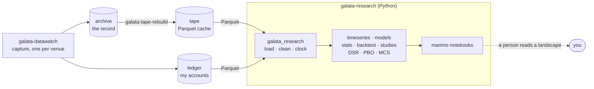
```mermaid
flowchart LR
    CAP["galata-datawatch<br/>capture, one per venue"]
    ARC[("archive<br/>the record")]
    TAPE[("tape<br/>Parquet cache")]
    LED[("ledger<br/>my accounts")]

    subgraph RES["galata-research (Python)"]
        LIB["galata_research<br/>load · clean · clock"]
        STAT["timeseries · models<br/>stats · backtest · studies<br/>DSR · PBO · MCS"]
        NB["marimo notebooks"]
    end

    CAP --> ARC -- galata-tape-rebuild --> TAPE
    CAP --> LED
    TAPE -- Parquet --> LIB
    LED -- Parquet --> LIB
    LIB --> STAT --> NB
    NB -. "a person reads a landscape" .-> YOU(["you"])
```

| It reads | Through | Never |
|---|---|---|
| the tape | Parquet, with partition listings and footer statistics | parses the archive, or writes to the record |
| the ledger | the verbatim `clearinghouseState` answers, decoded strictly | fetches from a venue, or reads an address |
| the frontier | segment filenames and footers | scans a dataset to say how far it goes |

The full framework architecture and roadmap are in the
[galata-datawatch README](https://github.com/sercanatalik/galata-datawatch#galata-at-a-glance).

---

## Features

- **One row per event.** Re-fetched candles (about three rows per 1h bar on
  the tape) keep their latest receipt. Replayed trades (2.75% of rows, resent
  17 s to 708 s after a reconnect) keep their first.
- **Closure by the record.** A bar is closed when a later bar exists or it was
  received after its close. The venue's `is_final` flag is not trusted: the
  history walk stamps the still-forming bar final.
- **No lookahead.** A candle is known at `close_ts`, not at its open, and
  `as_of` filters on that. A backtest position decided at a close earns the
  next bar. Each guard has a test that fails when the guard is removed.
- **Exact time, and its absence stated.** `ts` is the venue's own time (whole
  milliseconds on Hyperliquid). Marks and live funding carry none, so they
  are on `recv_ts` only, and `join_recv` is the one way across.
- **Gaps marked, never filled.** `mask_gaps` adds `in_gap` and `gap_cause`. A
  bar the venue restated after an outage is whole, and is not marked.
- **My account.** Margin and positions per snapshot per dex, on the venue's
  clock, decoded strictly: an undocumented shape is refused by its path.
- **Statistics that are checked against their papers.** The Deflated Sharpe
  Ratio reproduces Bailey and López de Prado's example (0.9004), and PBO by
  CSCV follows Bailey, Borwein, López de Prado and Zhu step for step.
- **Refusal by name.** An unknown ticker, a naive datetime, a missing root or
  an old schema is refused with what exists, never answered with an empty
  frame.
- **polars by default, DuckDB on request.** The rules exist once, in polars
  expressions. `engine="duckdb"` runs DuckDB over their output.
- **A common library, not notebook code.** Returns, annualisation, realized
  volatility, seasonality and the walk-forward schedule live in
  `gr.timeseries`; no notebook calls a private name, and a test walks every
  notebook's syntax tree to keep it so.
- **Models behind an extra, polars at the edge.** `gr.models` (arch, scipy)
  loads on first use, so the core stays numpy-free; nothing returns pandas.
- **Every forecast states its fit.** Each out-of-sample row carries
  `fitted_through`, never past its origin; a planted shock and a double shift
  each fail a test.
- **Other venues from their archives, never their APIs.** Binance, Bybit
  and OKX's published daily files land in a reference store apart from the
  record, each day with its URL, sha256 and status. Heavy kinds are fetched
  on declared days only, and a file in a unit or format the parser does not
  read is refused, not guessed.
- **Hand-written models are checked, not trusted.** Component GARCH reduces to
  GARCH's recursion, Beta-t-EGARCH's response to an outlier is bounded, CARR's
  range constant is measured, and each recovers a simulation.

---

## Screenshots

The marimo notebooks, run on the record as it stood on 2026-09-25.

**Candles.** How far each dataset goes, coverage per ticker, closes placed at
each bar's close, and an `as_of` slider where a bar appears only once it has
closed.

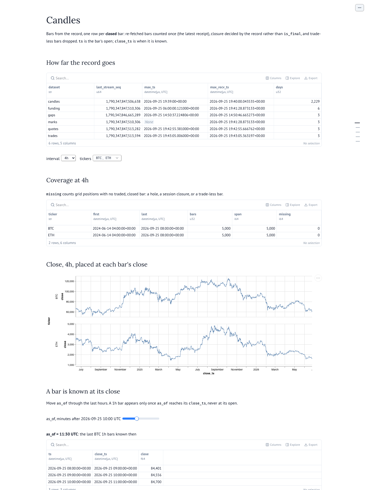

**Two clocks.** Every BTC trade in the busiest minute, with the mark, oracle
and mid received by its time, and funding settled, live and at its premium,
each on its own clock and broken where capture was down.

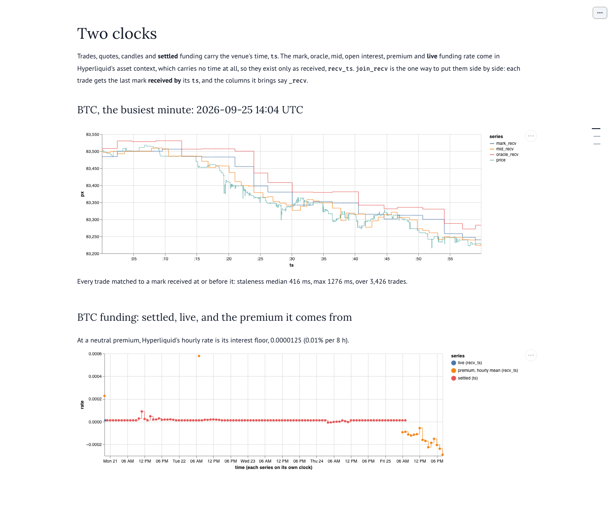

**Moving-average crossover.** A Sharpe landscape across fast × slow, and the
best trial's growth, gross and net of fees.

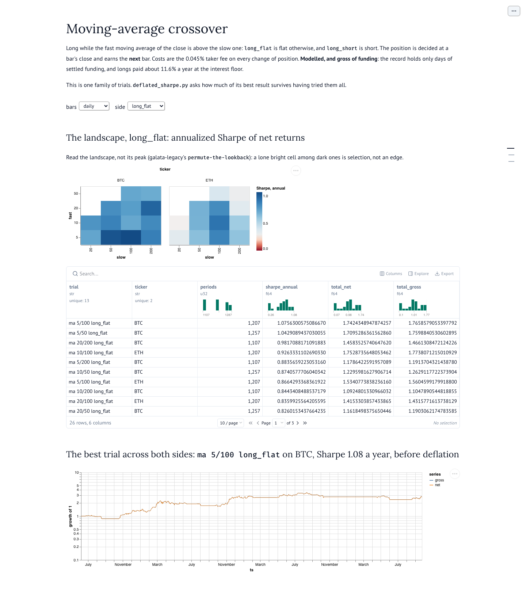

**The Deflated Sharpe Ratio.** The best of 66 trials against what luck would
give, and how the verdict moves with N.

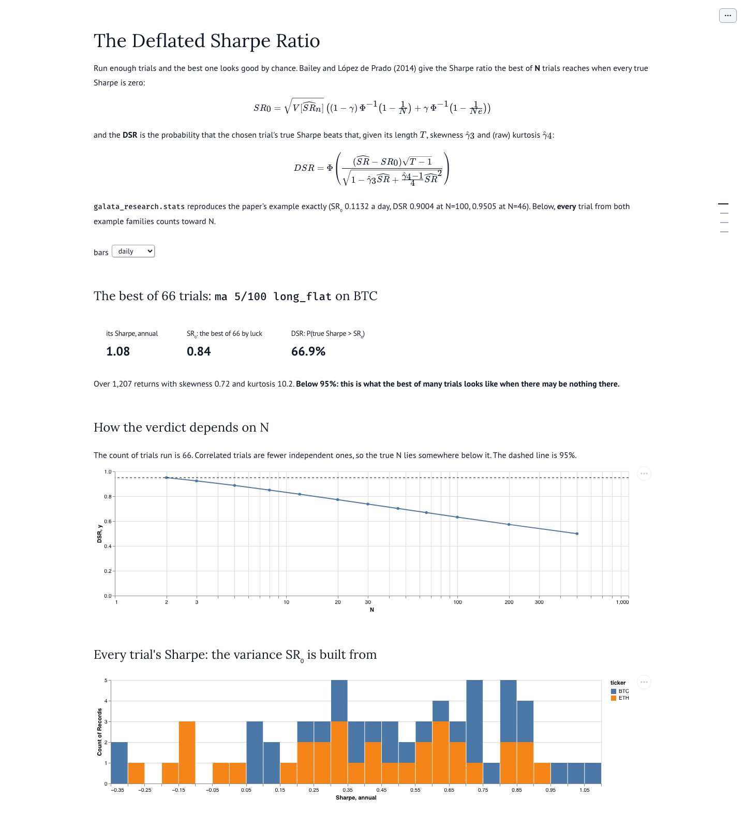

**Overfitting.** PBO over 12,870 splits, the logit distribution, performance
degradation, and one hold-out.

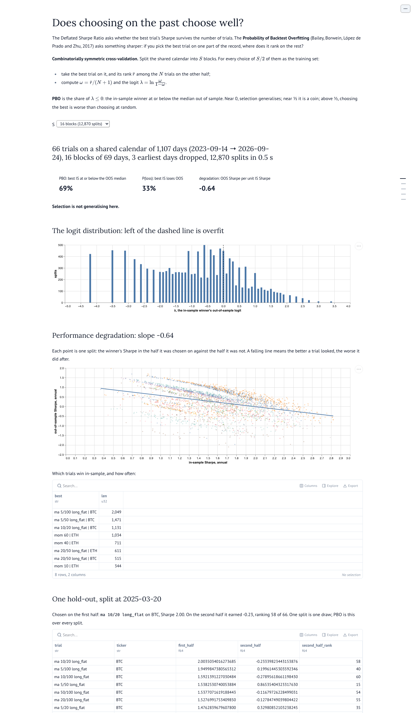

**A pre-registered test.** The Donchian ensemble run once against the criteria
frozen before it: the trials, growth, the verdict and the tails.

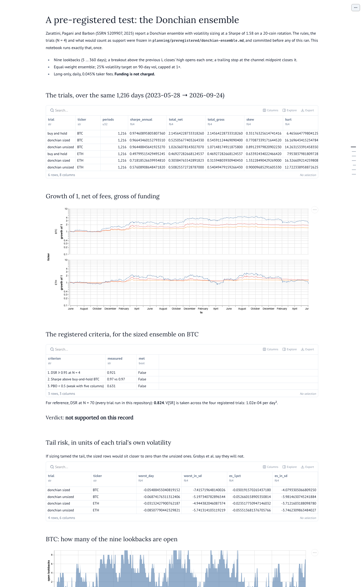

**Against its random twins.** Each trial's own runs of position shuffled into
1,000 random orders over the same bars: how much of a Sharpe is timing, and
how much is just being long.

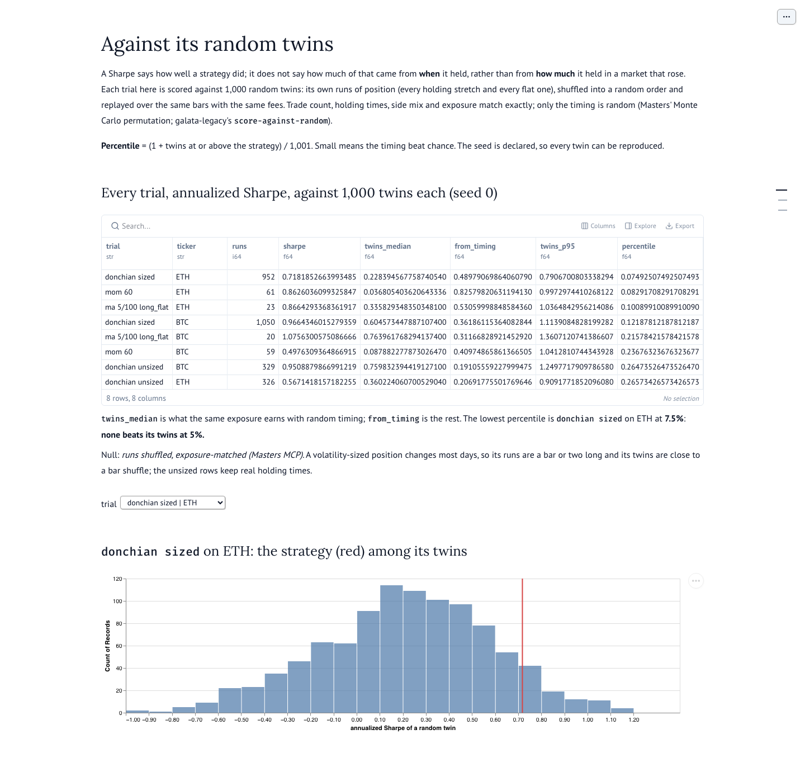

**The whole set.** White's Reality Check and Hansen's SPA over all 70 trials,
at three block lengths, and the trials a search would pick.

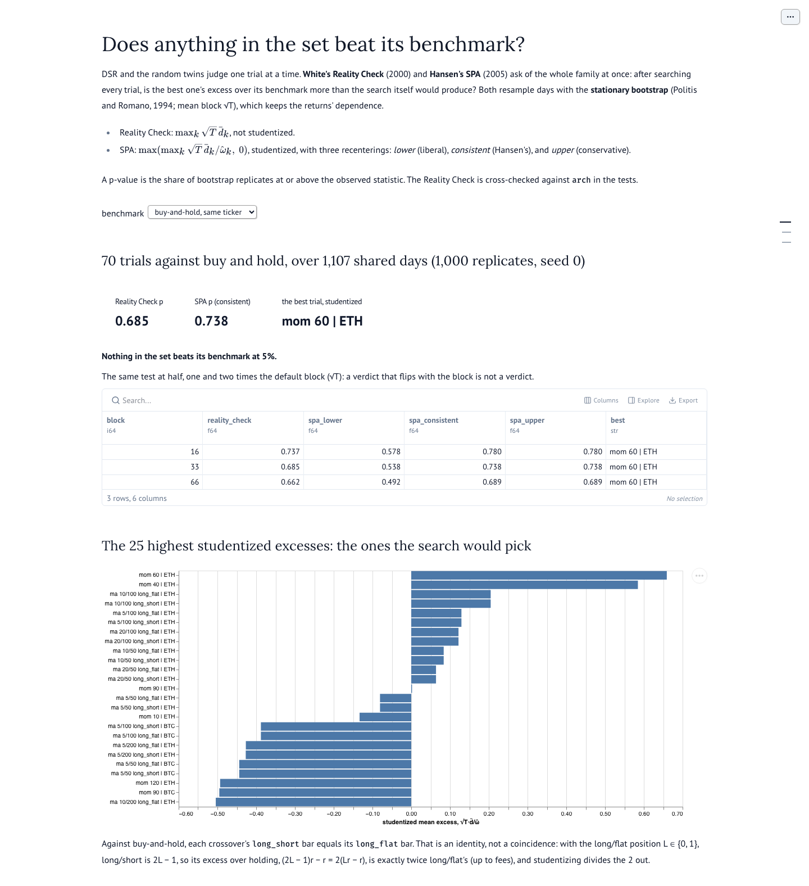

**Against markets with no structure.** The bars permuted as mcpt permutes
them (each bar's shape kept, their order random), and the whole search re-run
on each: the real best against the permuted bests.

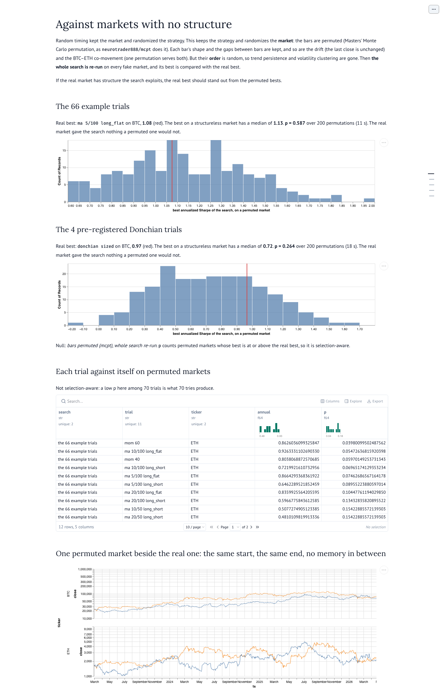

**GARCH, GARCH-t and variations.** The claims under test with their
sources, BTC's history split at the estimation period, fat tails and
clustering, the model families (hand-written ones included), and the
in-sample fit table. The walked-forward, scored and traded sections run
behind a button, so the export shows the in-sample half; their numbers are
in [The volatility study](#the-volatility-study).

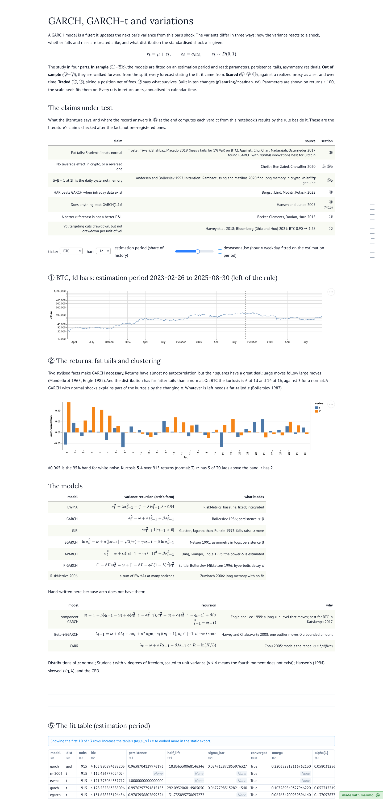

**The liquidity study: what survives.** Sixteen claims from the literature
and the data vendors, each citation checked against its source, each verdict
computed from the five study notebooks' own results. Ten are consistent. Two
are contradicted: jumps are not mostly negative, and ETH does not jump three
times as often as BTC. One is mixed, one immaterial, and two cannot be tested
here.

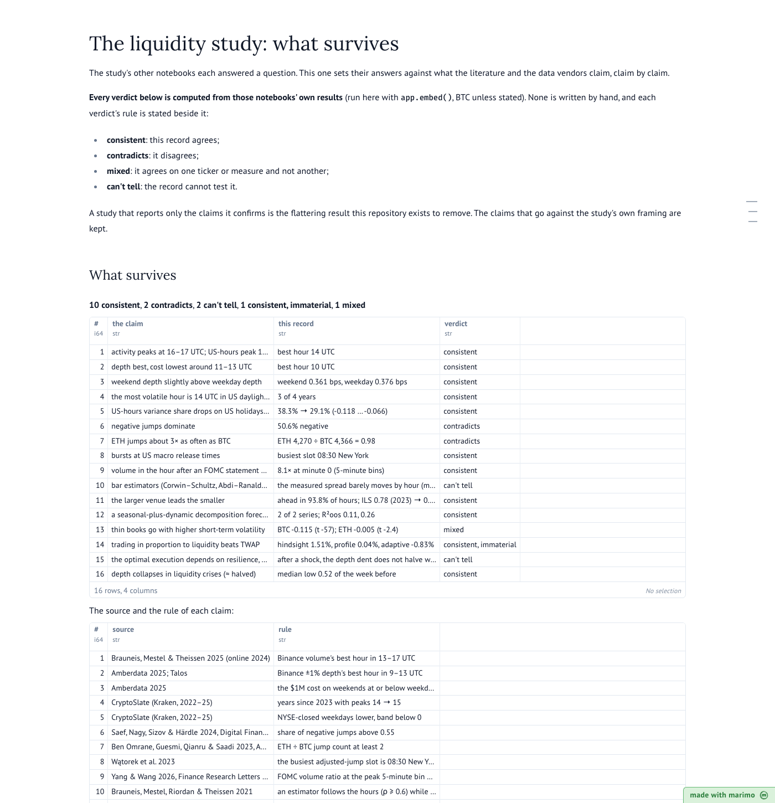

---

## Quick start

```bash
git clone https://github.com/sercanatalik/galata-research
cd galata-research
uv sync                                # add --extra models for gr.models (arch, scipy)
uv run pytest                          # fixture tapes, plus the real record when found
uv run marimo edit notebooks/candles.py
```

The record is found at `GALATA_VAR`, else `var_root` in
`./galata-research.toml`, else `../galata-datawatch/var`, the layout a
checkout beside galata-datawatch already has.

```python
import galata_research as gr

bars = gr.market.candles(["BTC", "ETH"], "4h", "2026-01-01T00:00Z", "2026-09-01T00:00Z")
bars.collect()                          # a polars LazyFrame, collected
gr.frontier()                           # how far each dataset is durable
```

---

## The library

### The record

| Call | Returns | The rule it owns |
|---|---|---|
| `gr.market.candles(tickers, interval, start, end, *, as_of, traded_only, closed_only)` | bars on `ts`, with `close_ts` | latest receipt per bar; closure by the record; `as_of` on `close_ts`; trade-less bars dropped |
| `gr.market.trades(tickers, start, end, *, as_of)` | executions on `ts` | first receipt per `(venue, ticker, trade_id)`; the venue's order within a message |
| `gr.market.quotes(tickers, start, end, *, as_of)` | top of book on `ts` | as received |
| `gr.market.funding(tickers, start, end, *, as_of)` | settled funding on `ts`: the rate and the premium it came from | only the rows the venue timed; premium null where the tape predates it |
| `gr.market.funding_live(...)`, `gr.market.marks(...)` | the predicted rate; mark, oracle, mid, OI, premium | on `recv_ts` only; `collapse=True` on request |
| `gr.market.gaps(tickers, start, end, *, series)` | gap events on the receipt clock | `from_recv_ts`, `to_recv_ts`, no `ts` |
| `gr.mask_gaps(frame, dataset, *, margin="1s")` | the frame plus `in_gap`, `gap_cause` | a tick inside `[from − margin, to)`; a bar overlapping and not restated |
| `gr.join_recv(left, right, *, tolerance="5s")` | `left` plus `<c>_recv`, `matched_recv_ts` | backward only, bounded, named |
| `gr.account.margin(...)`, `gr.account.positions(...)` | my snapshots per dex | venue time; `equity_held` false on a unified account |
| `gr.account.fills(...)`, `funding_payments(...)`, `ledger_updates(...)` | my history, from datawatch's ledger projection | one row per identity; ledger updates long, one row per dex moved; never an address |
| `gr.frontier()`, `gr.root()` | one row per dataset; where the record is | from names and footers, no scan; `GALATA_VAR`, then `galata-research.toml`, then the sibling checkout |

Every loader returns a `pl.LazyFrame`, or a DuckDB relation with
`engine="duckdb"`. Prices are `Float64` from the tape's `DECIMAL(38,18)`.

### Series: `gr.timeseries`, `gr.utils`

| Call | Returns | The rule it owns |
|---|---|---|
| `returns(bars, *, kind)` | `ticker, ts, close_ts, return`, simple or log | null on a ticker's first bar and after a hole: the backtest's rule, once |
| `periods_per_year(interval)` | 525,600 · 8,760 · 2,190 · 365 | calendar time: the venue never closes |
| `realized(bars, estimator, window)` | `n, sigma`: close-to-close, Parkinson, Garman–Klass, Rogers–Satchell, Yang–Zhang | one count for all five (a contiguous return, not in a gap); a figure only for a full window; no clamp |
| `realized_from(fine, interval)` | RV, realized range, semivariances, quarticity per coarser bucket | null unless the bucket holds every fine return |
| `resample(bars, every)` | whole 5m, 1h, 4h or 1d OHLC bars from finer ones, with `n` | a bucket missing any fine bar is dropped, not shortened |
| `ewma_vol(bars, *, lam)`, `ewma_max` | RiskMetrics' EWMA σ; the larger of a fast and a slow one | σ at close t is the forecast for t+1; warm-up until the seed weighs < 1% |
| `signature(bars_1m, minutes)` | mean daily RV per sampling interval | whole days only |
| `variance_breaks(returns, *, statistic)`, `segments` | breaks in the unconditional variance (κ₂ or Inclán–Tiao) and the segments between | κ₂'s over-detection under persistent GARCH measured and stated (17–41% at a nominal 5%) |
| `seasonal_factors(returns, *, fit, by, stat)`, `deseasonalize` | a volatility factor per (weekday, hour) cell, with its `fit_end` | fitted on `fit` only; mean f² = 1; hour × weekday by default |
| `extremes(bars, k, *, by, spacing)` | the k most extreme bars, spaced apart | picked by the data, never typed |
| `log_elasticity(frame, y, x, *, seasonal)`, `lagged_correlation(frame, a, b, lags, *, seasonal)` | the elasticity of one hourly series to another; their correlation at each lag | the day's shape taken off both first; a positive lag means the first leads |
| `walk_forward_origins(bars, split, *, window, every)` | one row per origin: `refit`, `fit_from`, `fitted_through` | `fitted_through ≤ close_ts`; rolling or expanding; fixed between refits |
| `stationary_bootstrap_indices`, `optimal_block` | resampling indices; the Politis–White block | agrees with arch to 1e-6 |
| `gr.utils.require`, `window`, `instant`, `lazy` | a refusal naming what is missing; micros | a naive time is refused |

### Models: `gr.models` (the `[models]` extra)

| Call | Returns | The rule it owns |
|---|---|---|
| `vol.fit(returns, *, model, dist, fit, measures)` | a `Fit`: parameters, persistence, half-life, σ̄, the in-sample σ and z | ewma, rm2006, garch, gjr, egarch, aparch, figarch, cgarch, betat, msgarch (two-regime Markov switching), and rgarch (Realized GARCH, with `measures`); each model's own persistence (GJR's γ weighted by E[z²·1(z<0)], EGARCH's β); gaps bridged, `after_gap` marked |
| `vol.table`, `vol.news_impact`, `vol.diagnose` | one row per fit; Engle–Ng's curve; Ljung–Box and ARCH-LM | ARCH-LM agrees with arch's to 1e-6 |
| `vol.walk_forward(returns, *, model, split, window, every, horizons, factors)` | one row per (origin, h): `variance`, `cum_variance`, `target_ts`, `fitted_through` | fitted on each refit's window only, fixed between refits; EGARCH and APARCH simulated, seeded; EGARCH with a t or skew-t tail refused beyond one step; deseasonalised fits re-seasonalised |
| `vol.har(measures, *, model, ...)`, `vol.carr(bars, ...)` | HAR, SHAR, HARQ on realized variance; CARR on the range | a training row only if its target is known at the refit; the insanity filter, marked `filtered` |
| `corr.fit(returns, *, model, dist, corr)`, `corr.ewma(returns, *, lam)`, `corr.walk_forward(returns, *, model, corr, split, every, horizons, factors)` | two-step DCC or cDCC (a, b, Q̄, R per bar) over each ticker's `vol` model; RiskMetrics' covariance; Σ per (origin, h, pair i ≤ j) with `n_eff` | one fit, so the σ that scales Σ standardised the returns behind R; the joint sample (a bar missing for any ticker dropped for all); pinned to rmgarch's `dccfit` path and likelihood |
| `memory.local_whittle(x, m)`, `memory.qu_test(x, m, *, epsilon)` | Robinson's local Whittle d; Qu's (2011) W against true long memory, with its critical values | follows `LongMemoryTS` line for line; size 3.5% and power 97% measured on simulations |
| `levels.fit(y)`, `levels.walk_forward(returns, *, split, every, horizons)` | Lu and Perron's random level shift model on log \|r\|; its flat variance forecasts in `vol.walk_forward`'s columns | a collapsed two-branch Kalman filter; κ from the fitting window only; recovered on its own simulation |
| `evaluate.proxies`, `evaluate.align` | a proxy per bar; forecasts joined to it, point or over exactly h bars | a hole leaves a cumulative target blank; rows after a gap dropped |
| `evaluate.scorecard`, `mcs`, `spa`, `dm`, `mz_gls`, `fluctuation`, `uspa`, `aspa`, `gw`, `mcs_horizons` | QLIKE and MSE per model × h; DM (HLN); the Model Confidence Set and SPA; MZ-GLS; Giacomini–Rossi; Quaedvlieg's uniform and average multi-horizon SPA and confidence set; Giacomini–White conditional test | every score on the same aligned rows; seeded bootstraps |
| `evaluate.value_at_risk`, `var_backtest` | VaR/ES by filtered historical simulation; Kupiec, Christoffersen, DQ, FZ0 | each statistic checked by hand in the tests |
| `vol.target`, `vol.trials`, `vol.economics`, `vol.es_t` | a position at each close from σ̂ (or from the refitted t's 1% expected shortfall); every trial; Sharpe, drawdown per unit vol, turnover, fees, FKO fee, DSR | the target known at the split; no second shift; every trial counted |

Install with `uv sync --extra models`. Without it `import galata_research`
still works and `gr.models` is refused by name.

### Costs: `gr.liquidity`

| Call | Returns | The rule it owns |
|---|---|---|
| `quoted(frame)` | `mid`, `spread_bps` | tape quotes or Bybit's rebuilt book |
| `effective(trades, quotes, *, tolerance, horizons)` | `effective_bps`, `realized_bps_<Δ>`, `impact_bps_<Δ>`, `known_ts_<Δ>` | the quote **strictly before** the trade's millisecond (98.7% of Hyperliquid trades share one with the book they changed); a realized spread is known at `ts + Δ` |
| `from_bars(bars, estimator, every)` | Roll, Corwin–Schultz, Abdi–Ranaldo or EDGE per bucket, with `pairs` | contiguous pairs only, a bar in a gap counts for nothing; EDGE pinned to its authors' values |
| `cost_of_size(depth, sizes)`, `book_points(book)` | the cost of a market order per side and size; Bybit's book as depth points | linear between bands from (0, 0), nothing extrapolated past the deepest band; overstates inside a wide first band |
| `flow(trades, every)`, `kyle_lambda(flow, *, by)`, `amihud(flow, *, by)` | signed flow per bucket; λ in bps per $1M with se, t, R²; Amihud | the aggressor's side; a return only after a bucket that traded; λ read as an association |
| `shocks(flows, *, share)`, `placebo(flows, shocks)`, `resilience(book, shocks, *, horizon)`, `resilience_curve(...)` | the largest one-second flows; quiet seconds as their placebo; each shock's depth dip and refill; the median depth curve | pre-shock depth known before the second's trades; read only against the placebo; medians, not means |
| `allocate(total, weights)`, `schedule_cost(plan, depth, *, slices)` | an order split across hours; a plan's cost against each hour's depth | ⑩'s linear book, one-minute children; plans compared, levels not read |
| `edge(open, high, low, close)`, `bars(trades, interval)` | the reference EDGE; OHLCV bars from trades | no bar for a minute with no trade |

### Clocks and calendars: `gr.timeseries.local_clock`, `gr.calendar` (the `[calendars]` extra)

| Call | Returns | The rule it owns |
|---|---|---|
| `timeseries.local_clock(frame, zone, prefix)` | `<prefix>_hour`, `_weekday`, `_date`, `_dst` | derived from `ts`, never stored; polars' pinned tz database |
| `calendar.sessions(exchange, start, end)`, `closures(...)` | sessions with UTC open and close and `early_close`; the weekdays it did not open | from `exchange_calendars`, maintained upstream: no holiday file here |
| `calendar.reopenings(exchange, start, end)` | each open after a closure over 24 h, with its length and kind | weekend, holiday or both; upstream's COMEX/NYMEX close an hour after Globex, stated |
| `calendar.mark_sessions(frame, exchange)` | `<x>_open`, `<x>_closed_day` | the exchange's own zone, never an abbreviation |

### Jumps: `gr.jumps`

| Call | Returns | The rule it owns |
|---|---|---|
| `periodicity(returns, *, slot, by, fit)` | a factor per slot of the week or day | Boudt–Croux–Laurent WSD after a ShortH pass; one jump cannot move it |
| `lee_mykland(returns, *, window, alpha, periodicity, rule)` | `sigma_local`, `L`, `threshold`, `jump` | the scale made only of earlier returns; K = ⌈√(252·n)⌉ (270 at 5m); Gumbel per day, or Benjamini–Hochberg |

### Lead and lag: `gr.leadlag`

| Call | Returns | The rule it owns |
|---|---|---|
| `hayashi_yoshida(x, y, lags)` | `lag_ms, hy, rho` | each series on its own clock, y's shifted by θ; the overlap sums telescoped, exact against the double sum |
| `lead_lag(x, y, lags, *, every)` | `lead_ms, rho_lead, rho_0, llr` per bucket | positive lead, or LLR above 1, means x moves first; within ±50 ms is clock skew |

### Trades and descriptions: `gr.trades`, `gr.stats`

| Call | Returns | The rule it owns |
|---|---|---|
| `trades.table(trial, bars=None)` | one row per trade: `side, entry_ts, exit_ts, bars, gross, cost, funding, net, open, spans_gap`; with bars, `entry_price, mae, mfe` | a trade is a stretch held on one side, a resize included; a flip's cost split by size and an exit's charged to the trade that left, so closed trades' costs sum to the frame's; excursions from the deciding close over the held bars only |
| `trades.summary(trial, bars=None, *, periods_per_year)` | per `(trial, ticker)`: win rate (all, long, short), profit factor, win/loss, mean and median, streaks, lengths, exposure, trades per year, mean MAE and MFE | closed trades only; a trial with no trade keeps its row; a ratio with no denominator is null |
| `stats.sortino`, `cagr`, `calmar`, `omega`, `ulcer_index`, `drawdown_duration` | one figure per series | Sortino's downside deviation over all N periods (Red Rock's 4.417 pinned) |
| `stats.rolling_sharpe(trial, window)`, `period_returns(trial, every)`, `describe(trial, periods_per_year)` | a Sharpe per full window; compounded returns per calendar period with `full`; one row of the above per trial | a window or a month cut by a hole is null or not `full`, never shortened |

### Indicators: `gr.indicators`

| Call | Returns | The rule it owns |
|---|---|---|
| `add(bars, **named)` | the bars sorted, plus one column per indicator | each expression evaluated per `(ticker, contiguous stretch)`: none spans a hole, and each warms up again after one |
| `sma`, `ema`, `rsi`, `macd`, `macd_signal`, `zscore`, `bollinger`, `true_range`, `atr`, `stochastic`, `supertrend` | `pl.Expr` over one contiguous series | null before a full window; EMA seeded with its first n values' mean, RSI and ATR Wilder-smoothed (RSI converges to StockCharts' table); every value known at its bar's close, a truncation test for each |
| `hold(enter_long, exit_long, enter_short, exit_short)` | a position held between events | an exit closes only the side held; an entry wins, so an opposite entry flips; null until the conditions exist |

`gr.studies.ema_crossover`, `rsi_reversion`, `bollinger_reversion`, `macd_cross`
and `supertrend` are the trial families, and `indicator_signals` is the
registered 50-rule search (`planning/preregistered/indicator-signals.md`).

### Reference data: `gr.reference` and `galata-fetch`

The record holds one venue, 1h bars from 2026-03, and a week of top of book.
To see years, depth, and other venues, research reads **published historical
archives** too. `galata-fetch` downloads them into a reference store kept
apart from the record: `var/reference/`, or `GALATA_REFERENCE`, or
`reference_root` in `galata-research.toml`. It is the one command here that
downloads, and settled point 8 says what it may do:
- archives only, from `data.binance.vision`, `public.bybit.com`,
  `quote-saver.bycsi.com` and `static.okx.com`;
- never a venue's live API, and never my account.

```sh
galata-fetch depth   binance-um   BTC ETH --from 2023-01-01 --to 2026-09-26 --dry-run
galata-fetch candles binance-um   BTC     --from 2019-12-31 --to 2026-09-26
galata-fetch trades  bybit-linear BTC     --from 2023-01-01 --to 2026-09-26 --sample every:3
galata-fetch book    bybit-linear BTC     --from 2023-01-18 --to 2026-09-26 --sample weekly:wed
galata-fetch trades  okx-swap     BTC ETH --from 2023-01-02 --to 2026-09-26 --days 2026-09-26
galata-fetch update  --dry-run    # each declared series from its last day to yesterday
```

| Call | Returns | The rule it owns |
|---|---|---|
| `gr.reference.depth(tickers, start, end, *, venues, as_of)` | Binance's cumulative depth per band, every 30 s | `band_pct` signed, bid negative; ±0.2% only in later files |
| `gr.reference.trades(..., rpi=None)` | signed trades: Binance aggTrades, Bybit and OKX executions | Bybit time exact to 100 µs from its text; OKX sizes in BTC/ETH, not contracts; `rpi=False` drops Bybit's retail-price-improvement and OKX's Enhanced Liquidity Program fills |
| `gr.reference.book(...)` | Bybit's book replayed, one row per second: top, depth within 2 and 10 bps, each side's reach | a band past the deepest level held is null, never a truncated sum |
| `gr.reference.candles(...)` | Binance 1m bars | known at `close_ts`; `as_of` filters on it |
| `gr.reference.events(start, end, *, sources)` | CPI, jobs and FOMC with their UTC release instants | fetched from bls.gov and federalreserve.gov by `galata-fetch events`; BLS only with `GALATA_CONTACT`, which is never stored |
| `gr.reference.coverage()` | per series: `first, last, days_ok, days_absent, days_mismatch, days_missing` | absent (the archive lacked it) is not missing (never fetched) |

The fetch has these rules:
- **One manifest row per day**, holding the URL, sha256 and Binance's published checksum. It makes every day refetchable and checkable. The raw archive is not kept.
- **Idempotent:** a day already held `ok` is skipped.
- **Checked:** a checksum that disagrees is `mismatch`, and nothing is written.
- **A changed refetch** is `mismatch`, and the old day is kept.
- **Sized first:** `--dry-run` states the days and bytes and downloads nothing.
- **Heavy kinds on declared days only.** A Bybit BTC book day is 93–167 MB zipped. `book`, Binance `trades` and OKX `trades` need `--days` or `--sample` (`weekly:<dow>`, or `every:<n>`, which turns through the week).
- **Kept current by `galata-fetch update`.** It brings the forward claims' series (BTC depth and candles, ETH candles, BTC trades on both venues every ninth day) from each one's last `ok` day to yesterday, and asks again for days recorded `absent` because they were asked before publication. galata-datawatch's cereyan lane runs it daily at 07:30 UTC as the flow `update-the-reference`, from `py/signals`' pinned environment, with the store named by `GALATA_REFERENCE`. Without `GALATA_CONTACT` it keeps the BLS events already held.
- **OKX's day is Beijing's.** Its file for a date runs 16:00 to 16:00 UTC and is stored under that date; a named UTC day fetches that date's file and the next. Its archive is taken from 2021-11-01: October 2021 lists every trade twice, as a BUY and a SELL, and is refused.

No frame has `recv_ts`: an archive has no receipt clock, and none is made up.

---

## Two clocks

| | Venue time, `ts` | Receipt time, `recv_ts` |
|---|---|---|
| **what it is** | when the venue says it happened | when capture received it |
| **on it** | candles (`close_ts` too), trades, quotes, settled funding | marks (mark, oracle, mid, OI, premium), the live funding rate, gap bounds |
| **why** | the venue stamps these | Hyperliquid's asset context carries no time at all |
| **never** | filled from receipt | joined to `ts` except through `join_recv` |

`join_recv` gives each venue-timed row the last value received by its `ts`.
Over the busiest BTC minute, 3,426 trades matched with a median staleness of
416 ms, and none matched forward.

---

## Studies

`gr.stats` (Sharpe, PSR, the expected maximum Sharpe, DSR, PBO, the permutation percentile, the Reality Check and SPA, the performance fee, maximum drawdown; and, as descriptions, Sortino, Calmar, Omega, the Ulcer index, drawdown duration, rolling Sharpe and calendar-period returns),
`gr.trades` (a trial's positions as trades, each charged its own turnover, with MAE and MFE; win rate, profit factor, streaks and exposure per trial),
`gr.backtest.returns` (next-bar, fees on turnover, holes not spanned,
`modelled` on every row; settled funding charged on every hour held when
`funding=gr.market.funding(...)` is passed, and `funding_charged` says where
it was) and `gr.studies` (trial families that return every
trial, so N is the true N) back these notebooks:

| Notebook | Asks |
|---|---|
| `candles.py`, `ticks.py`, `gaps.py`, `clocks.py`, `account.py` | what the record holds, and how the loaders read it |
| `moving_average.py`, `momentum.py` | a Sharpe landscape for two example families |
| `indicator_signals.py` | do the standard indicators survive their search? The pre-registered test of five families (EMA, RSI, Bollinger, MACD, Supertrend), 50 rules × BTC, ETH, N = 100, against DSR, PBO, the Reality Check and permuted bars, with six years of Binance as a secondary. Registered (`020ef19`); **not yet run on the record** |
| `trades.py` | what do the trials' trades look like? Sortino, Calmar, Ulcer and drawdown length per trial, win rate, profit factor and MAE/MFE per trade, the month-by-month table and a rolling Sharpe. Descriptions, not verdicts |
| `deflated_sharpe.py` | does the best of 66 trials beat what luck would give? DSR 0.67 daily: **no** |
| `overfitting.py` | does choosing on the past choose well? PBO 0.69 over 12,870 splits: **no** |
| `donchian_ensemble.py` | the pre-registered test below |
| `random_timing.py` | is it the timing, or just the exposure? Each trial against 1,000 twins with its own runs shuffled: **none beats its twins at 5%** |
| `whole_set.py` | does *anything* in the set beat its benchmark? White's Reality Check and Hansen's SPA over 70 trials: **no**, against buy-and-hold (p ≈ 0.7) or cash (p ≥ 0.07) |
| `volatility.py` | what was the volatility? Five window estimators, two EWMA baselines, RV and realized range from finer bars, the signature plot, the calendar in hourly volatility, and the walk-forward schedule. On BTC the range estimators read **above** close-to-close, 7–12% at the median on 1d and 1h, as legacy's testnet week found |
| `garch.py` | GARCH, GARCH-t and variations, in sample and walked forward, scored and traded: see [The volatility study](#the-volatility-study) |
| `liquidity.py` | when is the market liquid? Hour-of-week depth, volume and trade count, per venue, since 2023, from the reference store and the tape. On BTC, Binance's ±1% depth is best at **10 UTC** and worst at 22 UTC (×1.12), while volume peaks at **14 UTC** (×1.7–2.1 the day's mean) and troughs at 4–5 UTC on Binance, Bybit, OKX and Hyperliquid alike (OKX's BTC profile ρ 0.97 with Binance's). The day's shape barely moved from 2023 to 2026 (Spearman ρ 0.92–0.96 year on year) |
| `liquidity_costs.py` ⑤ | what does trading cost, by the hour? Measured on Bybit's rebuilt book and the tape, and estimated from bars. The median quoted spread sits at one tick in every hour on BTC, ETH and HYPE, and even the time-weighted spread barely moves by hour (max ÷ min ≈ 1.07–1.1), too flat to calibrate a bar estimator against. Corwin–Schultz tracks it best (ρ 0.93 on the tape) at 2–3× the level; EDGE, Roll and Abdi–Ranaldo do not track it |
| `liquidity_clock.py` ⑥ | whose clock does crypto keep? Since 2022, **New York's**: BTC's most volatile hour is 14 UTC in US summer time and 15 UTC in winter, the two regimes line up better on the New York clock than on UTC every year (not in 2020–21), and on NYSE-closed weekdays New York's 10:00–16:00 carries 9 points less of the day's variance (38% → 29%). Binance depth's day keeps UTC's shape |
| `liquidity_clock.py` ⑦ | when does the price jump? Lee–Mykland on 5m returns after a robust periodicity: on BTC and ETH the busiest 5-minute slot is **08:30 New York**, US macro releases (3× the average slot), then **14:00**, FOMC. Jumps are half negative, not mostly, and carry 23% of the variance |
| `liquidity_clock.py` ⑧ | what happens around a release? Against the same New York time on matched days, BTC's 5-minute |r| is **4.8× at an FOMC statement and 4.2× at CPI**, 2.2× at the jobs report, 2.0× at the NYSE open; more than a quarter of CPI and FOMC release bins hold a jump. Back under 1.5× within 15–25 minutes. Funding times and Deribit expiries show nothing |
| `liquidity_venues.py` ⑨ | who moves first? Shifted Hayashi–Yoshida on trades: **Binance leads Bybit** in 94–96% of hours on BTC and ETH (LLR ≈ 1.4, 213 BTC and 195 ETH days since 2023), and on BTC **OKX sits between them**: Binance leads OKX in 76% of hours (LLR 1.10) while Bybit is ahead of OKX in only 10% (LLR 0.75), a lead that shortened from ~100 to ~50 ms and is steadiest at the US open. On the tape's two days, **Hyperliquid trails both by ~500 ms on BTC and ETH, but not on HYPE**, its home market |
| `liquidity_costs.py` ⑩ | what does a size cost, by hour? Walking Binance's hourly median book: $1M of BTC costs ~0.3–0.4 bps, cheapest at 9–11 UTC and 15% dearer at 21–23 UTC; GOLD's is 60% dearer while COMEX is shut; HYPE's is flat. The bands overstate BTC's near-touch cost ~16× against Bybit's book, so the hours, not the levels, are the finding |
| `liquidity_costs.py` ⑪ | what does the flow move? Kyle's λ on 1-minute signed flow: a net $1M moves BTC 0.58 bps on Binance and 0.86 on Bybit; on the 213 days OKX is held too, 0.61, 0.90 and 1.04 on OKX, whose BTC volume matches Bybit's; λ has fallen on all three since 2023; HYPE moves least on Hyperliquid, its home venue |
| `liquidity_clock.py` ⑫ | what do the xyz perps do while their underlying sleeps? Weekend volume falls to 14–25% of open hours and |r| to 0.2–0.5×; the reopen hour moves 1.4× (gold, XYZ100) to 2.8× (oil). The weekend price is not undone at the reopen (slopes near 0); Binance gold's even continues. BTC and ETH also stir when CME reopens |
| `liquidity_venues.py` ⑬ | whose price is the price? A daily VECM at 100 ms: Binance's share of BTC price discovery against Bybit fell from ILS 0.78 (2023) to 0.47 (2026), and its CS from 0.77 to 0.52: roughly shared now. Hyperliquid's shares are distorted by its block-time stamps, and are not read |
| `liquidity_costs.py` ⑭ | how fast does the book refill? After a top-0.1% one-second flow on Bybit, the side it took keeps ~62% of its 2 bps depth; a third of the dent refills in 2–3 s and the rest is still missing after 60 s, on BTC, ETH and HYPE alike (quiet seconds: ~1.00) |
| `liquidity_stress.py` ⑮ | what happens when it breaks? In the ten widest BTC hours since 2023, ±1% depth falls to about half its usual level, and in six of ten is not back within 48 h; in seven of ten the book was already thinner in the six hours before. On the day, λ rises up to 4× and Bybit's spread up to 2× |
| `liquidity_stress.py` ⑯ | can the next hour's liquidity be forecast? Out of sample since 2025, a seasonal-plus-HAR decomposition beats persistence by 11–14% on BTC/ETH depth and 26–27% on volume (DM t ≈ −13 and −33); the average week alone is 23–37× worse than persistence on depth, whose level, not its week, is what moves |
| `liquidity_stress.py` ⑰ | does it pay to work an order when the book is deep? For a BTC day order, out of sample over 526 days, even hindsight saves only 1.5% against TWAP (depth moves ~12% through the day); the average-week profile captures 3% of that, and an hour-ahead adaptive rule loses 0.8%. Timing within the day barely matters here |
| `liquidity_costs.py` ⑱ | how does depth move with volatility? On BTC, doubling realized variance goes with ~8% less ±1% depth (elasticity −0.115), and the two are anti-correlated at every lag; on ETH, depth's level ignores volatility. Hour to hour, depth falls in the hour volatility rises, not hours before |
| `liquidity_claims.py` | what survives of the liquidity study? Sixteen claims from the literature and vendors, each citation checked against its source, each verdict computed from the five study notebooks (`app.embed()`): 10 consistent, 2 contradicted, 1 mixed, 1 immaterial, 2 can't tell |
| `liquidity_forward.py` | do the liquidity findings hold on data not yet seen? Seven claims registered in `planning/preregistered/liquidity-forward.md` (committed alone, `98b1e53`, 2026-09-28), scored only from 2026-09-29: all *not yet decidable* today. A dry run from 2026-06-01 (not a result) would support four and not two, jumps at 08:30 and depth forecasting among them |
| `har_long.py` | does *HAR beats GARCH* hold on six years? Registered (`3e02cfb`), then run on Binance 1m klines, 2020–2026, out of sample from 2024-09: **at 1d, yes on BTC and ETH, and HARQ significantly** (uSPA p 0.016, 0.000), with the gap widening to 30 days (QLIKE ÷ GARCH 0.80, 0.62). **At 4h it does not travel**: BTC's HAR loses beyond one bar, and ETH's edge is not significant. HAR on 5-minute RV does worse, because that RV sits 9–23% above the squared return it is scored against. **With that level removed** (a constant fitted before the split; registered `68ae3e3`), 5-minute HAR beats GARCH at every horizon in 3 of 4 cells, and HARQ significantly at 1d on both and at ETH 4h A random level shift model (Lu and Perron 2010; registered `33c1443`) does not help: it beats GARCH at every horizon in no cell and loses to HAR everywhere |
| `vol_long.py` | does the whole volatility study hold on six years? `garch.py` replayed unchanged on Binance BTC and ETH, 1d and 4h, 2020–2026 (registered `2d8d580`): **29 of 34** of the record's decided verdicts repeat. Five claims hold everywhere (t beats normal, intraday persistence, targeting and drawdown, both feedback claims); BTC's 4h leverage effect was the short sample's (γ +0.106 → +0.011); *GARCH outside the multi-horizon MCS* is sample-specific At 1h (registered `dfef488`, ~58,000 bars) **12 of 18** repeat: the record's *α+β≈1 at 1h is the daily cycle* fails on six years (deseasonalised persistence stays 1.0000), and feedback stops tracking better. Over all three bars only *t beats normal* and *feedback's Sharpe gain is not significant* hold everywhere |
| `mcs_split.py` | does *GARCH outside the multi-horizon MCS* turn on the split? The same replay at shares 0.5–0.8 (registered `33f95b8`): **yes**, in 3 of 4 cells; only ETH 1d says the same at every split. *Something beats GARCH* is stable at 1d on both tickers, so the record's BTC 1d *no* was its sample; 4h verdicts and the shortest window move most |
| `persistence_1h.py` | is 1h persistence of one on six years neglected variance breaks? GARCH-t between κ₂ breaks against random cuts (registered `f227e8b`): **no**. The breaks lower it more than random cuts do, but the median between them stays above 0.99, and years-long segments still fit 1.0000 |
| `long_memory.py` | is that persistence true long memory, or level shifts? Qu's (2011) test on log \|r\|, validated on simulations first (registered `d6509ae`): **level shifts**. All four cells (BTC, ETH × 1h, 1d) reject true long memory at 1%, and the long-memory estimate falls as the bandwidth widens in every cell. GARCH's α+β ≈ 1 there is likely level shifts or a trend, not memory |
| `permuted_bars.py` | is there structure to find at all? The whole search re-run on 200 markets with the bars permuted: the real best (1.08) is **below** the permuted median (1.13), p = 0.59 |

**Pre-registered forward claims.** `planning/preregistered/liquidity-forward.md`
froze seven of the liquidity study's findings on 2026-09-28, committed alone
before the data that tests them exists. `notebooks/liquidity_forward.py` scores
them from 2026-09-29, once each sample is complete: fetch new days with
`galata-fetch` to keep it current.

**A pre-registered test.** `planning/preregistered/donchian-ensemble.md` froze
the Donchian ensemble of Zarattini, Pagani and Barbon (SSRN 5209907) as four
trials, and said what would count as support, and was committed before any
code ran it. Run once, the sized ensemble on BTC had a DSR of 0.921 at N = 4,
a Sharpe of 0.97 against buy-and-hold's 0.97, and a PBO of 0.63: **not
supported on this record.**

Every figure is modelled at Hyperliquid's 0.045% taker fee. Settled funding
is charged on every hour a position is held when it is passed
(`funding=gr.market.funding(...)`), and `funding_charged` says on which bars;
the studies above predate it and were run without it.

---

## The volatility study

`notebooks/garch.py` and `notebooks/volatility.py`, built in ten changes
(`planning/roadmap.md`). The question: which of the GARCH family, GARCH-t and
their variations forecasts crypto volatility best out of sample, and does a
better forecast earn anything once it sizes a position? Each section carries
its theory and the literature, and every claim the literature makes is
checked on this record. Figures are BTC, daily unless stated, the first 70%
of the history as the estimation period and the rest walked forward.

**In sample.**

| | finding |
|---|---|
| Tails | Student-t beats normal by 97 BIC points; ν ≈ 3.2 |
| Asymmetry | GJR's γ is small (≈ 0.06), not the equity leverage effect |
| Persistence at 1h | GARCH-t's α+β is 1.0000 raw and 0.9948 once divided by an hour × weekday factor: the daily cycle, not long memory (Andersen and Bollerslev 1997) |
| Range estimators | read 7–12% **above** close-to-close at the median, as legacy found on testnet |
| Component GARCH | ρ 0.9947, φ 0.047, near Katsiampa's (2017) 0.9999 and 0.055, but it does not beat GARCH-t by BIC |

**Forecasting** (QLIKE relative to EWMA, r² proxy, lower is better):

| model | 1 day | 7 days | 30 days |
|---|---|---|---|
| HARQ | 0.950 | 0.753 | 0.470 |
| CARR | 0.951 | 0.727 | 0.420 |
| HAR | 0.952 | 0.757 | 0.470 |
| component GARCH | 0.974 | 0.824 | 0.579 |
| GJR | 0.976 | 0.794 | 0.606 |
| GARCH | 0.982 | 0.817 | 0.578 |
| EGARCH | 0.990 | — | — |
| Beta-t-EGARCH | 0.995 | 0.837 | 0.550 |

EGARCH's 7- and 30-day cells are withdrawn. With a Student-t tail its
multi-step variance does not exist, so the 0.910 and 0.667 once shown were
draws of a Monte Carlo mean that never settles; see *EGARCH-t has no horizon*
below. Beta-t-EGARCH is built so that its moments exist, and it keeps its row.

Realized GARCH (Hansen, Huang and Shek 2012), fed daily RV from six 4h
returns, ties GARCH at one day (0.982), and is the best of EWMA, GARCH, HARQ
and itself at 30 days (0.447 against HARQ's 0.470), where the confidence set
is the two of them. In sample its persistence is 0.68 against SPY's 0.975,
and σᵤ 1.02 against 0.38: a six-return RV is a noisy measure.

Across the whole horizon path at once (Quaedvlieg 2021, 1/7/30 days, block
bootstrap), CARR, HARQ and HAR beat GARCH **at every horizon** (uniform SPA p
0.001, 0.002, 0.012), which the per-horizon confidence sets could not show;
GARCH beats EWMA on average (p 0.019) but not uniformly (0.076); GJR adds
nothing over GARCH (0.63).

As a set across all three horizons (Quaedvlieg's multi-horizon MCS, 90%,
uniform and average alike): CARR, HARQ, HAR and GJR; GARCH and EWMA are out
(p 0.060).

*When* they win is predictable too (Giacomini and White 2006, instruments
known at the origin): HARQ's and CARR's edge over GARCH grows with the
forecast volatility (coefficient +0.18 to +0.25; p 0.042 and 0.009 with a
500-day rolling window, where the test's theory holds, and 0.000 and 0.002
expanding), and their decision rule would pick them on about half to three
quarters of days. EWMA and GJR show no predictable pattern.

A two-regime Markov-switching GARCH (Haas, Mittnik and Paolella 2004) fits
BTC daily as a fast-switching mixture, expected stays of about two days,
rather than as calm and turbulent epochs. It is indistinguishable from GARCH
out of sample (0.975, 0.829, 0.583 against 0.982, 0.817, 0.578; all three in
every confidence set) and loses to GARCH-t by BIC (5820 against 5816).

The models built on intraday or range information lead at every horizon, as
the literature on Bitcoin reports (Bergsli et al. 2022). The Model Confidence
Set at one day holds all nine models: the data cannot separate them. At 30
days it holds CARR alone.

**Trading** (σ̂-targeted long position, 0.045% per change, 29 trials):
no trial makes money over the out-of-sample year, a falling market. Hold's
Sharpe is −0.31 and the best trial's (EGARCH, inverse vol) −0.23, with a
Deflated Sharpe Ratio of 0.33. Drawdown per unit of volatility does not
improve (1.21–1.37 against hold's 1.21). And the forecasts' order does not
carry over: ρ(QLIKE rank, Sharpe rank) is 0.21, so HARQ, first by QLIKE, is
fourth by Sharpe, as Becker, Clements, Doolan and Hurn (2015) warn.

Sizing on the refitted Student-t's 1% expected shortfall instead of σ̂ adds
nothing on BTC daily: ν̂ moved only between 3.06 and 3.46 across refits, so
the ES positions are within about 1% of inverse vol's (Sharpe −0.37 against
−0.38 for GARCH, −0.22 against −0.23 for EGARCH).

**Closing the loop changes the trading result.** Feedback-controlled targeting
(Devanathan, Rueter, Boyd et al. 2026, their g = 55 and θ = 0.6 as published)
multiplies the leverage by e^κ, with κ steered by the gap between the
position's own realized volatility and the target. Against a 47.1% target it
lands within about 1% (vol error 0.004–0.012, against 0.08–0.12 open-loop),
and lifts every model's net Sharpe (GARCH −0.37 → −0.06, EGARCH −0.23 →
−0.07, EWMA −0.38 → **+0.14**, the study's first positive trial) despite about
4× the turnover and 2% in fees a year. One out-of-sample year, and more
trials in the Deflated Sharpe's count: a result on this record, not yet a
claim.

**The Sharpe gain did not survive a registered test; the tracking did.**
`planning/preregistered/feedback-sharpe.md` fixed a test before it was run
(commit `cdda013`). It walked the same procedure from a 40% split
(2024-08-02) and scored only the unseen span to the old split (2025-08-30,
393 days), using Ledoit and Wolf's (2008) studentized block-bootstrap test of
two Sharpe ratios with Holm. The registered verdict is **refuted**: feedback's
net Sharpe is below open loop's for all four models walked (Δ −0.03 to −0.10
a year, p 0.82–0.95). HAR and HARQ could not be walked, as registered. On the
seen year the gain is real in the point estimate but not significant (p
0.23–0.74), and the block length changes no p by more than 0.01. The
paper's actual claim holds in every span: vol error 0.004–0.013 against
0.02–0.15 open-loop. On this bootstrap, `gr.models.evaluate.sharpe_difference`
rejects 6.0% of true nulls at 5% on Ledoit and Wolf's GARCH null (their 5.5%);
the HAC version rejects 7.25% (their 7.2%).

**Replicated on ETH and HYPE, most claims hold only in part.**
`planning/preregistered/replication.md` (commit `20fbe74`) set BTC's verdicts as
predictions before any other ticker was run. `notebooks/replication.py` then
replays `garch.py` unchanged for ETH and HYPE at 1d, 4h and 1h. ETH repeats 21
of BTC's 28 decided verdicts, and HYPE 12 (6 differ). HYPE 1d decided nothing
in the registered run: its EGARCH-t forecasts overflowed and `garch.py` failed.
By the registered rule all eleven claims are *mixed*; none generalises, and
none is BTC-specific. Run again after the fix below, HYPE 1d repeats 6 of BTC's
10 decided 1d verdicts. That run is secondary because it came after the
registration. *t beats normal* is among the four it does not repeat
(ΔBIC +1), the first cell to break that claim. Where a verdict could be reached:
- **every decided cell agrees:** t beats normal, a better σ is not a better
  P&L, and feedback's Sharpe gain is not significant;
- **HAR and HARQ beat GARCH:** agrees at ETH 1d, the only other cell that
  could decide it;
- **ticker by ticker:** whether anything beats GARCH(1,1) or leaves it out of
  the confidence set (2 of 5 cells agree);
- **BTC alone:** the 4h leverage effect;
- **not everywhere:** feedback's tracking fails on ETH daily (1 of 6 models)
  and on HYPE 4h.

**EGARCH-t has no horizon.** EGARCH's recursion is in logs,
ln σ²ₜ₊₁ = ω + β ln σ²ₜ + α(|zₜ| − E|z|) + γzₜ. So E_t[σ²_{t+2}] carries
E[e^{α|z| + γz}], which is infinite under a Student-t: the density falls like
a power of |z|, and the exponential outgrows it. There is no multi-step
variance to forecast. The running mean of e^{0.2|z|} under t(3.5) jumps from
1.17 to 269 and on to 3.7e4 as draws are added; under the normal it converges
to 1.182. `vol.walk_forward` now refuses EGARCH with a t or skew-t tail beyond
one step. GED is kept: arch bounds its shape at ν ≥ 1.01, where the
expectation is finite. `garch.py` walks EGARCH-t one step ahead only. Re-run,
none of BTC's 33 verdicts at 1d, 4h and 1h moved; the 1d multi-horizon MCS p
for GARCH went from 0.075 to 0.060.

**Breaks do not explain the persistence.** Sansó, Aragó and Carrion's κ₂
finds no variance break in BTC's daily or hourly returns. It is itself
oversized under persistent GARCH (17–41% at a nominal 5%, measured), so a lack
of breaks is the robust reading. Inclán and Tiao's original finds five, but it
also rejected 93–96% of break-free GARCH series. The daily α+β ≈ 0.99 is
therefore not the Lamoureux–Lastrapes artefact: it fits Rambaccussing and
Mazibas's genuine long memory. The hourly unit root is the daily cycle, which
deseasonalising removes.

**What survives.** ⑬ decides each claim from the notebook's own results, by
a rule stated beside it. `notebooks/replication.py` replays that notebook,
unchanged, for each ticker and bar, and generates the table below
(`survival_table`). It was run on 2026-09-28, with the record through
2026-09-27 and the code after item 22. `yes` means the claim holds there, `no`
means it does not, and `—` means the section could not decide. The last column
counts how often ETH's and HYPE's decided cells repeat BTC's.

| claim (source) | BTC 1d · 4h · 1h | ETH 1d · 4h · 1h | HYPE 1d · 4h · 1h | repeats BTC |
|---|---|---|---|---|
| t beats normal (Troster et al. 2019; *against*: Chu et al. 2017) | yes · yes · yes | yes · yes · yes | no · yes · yes | 5 of 6 |
| no leverage effect (Cheikh et al. 2020) | yes · no · yes | yes · yes · yes | yes · yes · yes | 4 of 6 |
| α+β≈1 intraday is the daily cycle (Andersen and Bollerslev 1997) | — · no · yes | — · no · yes | — · no · no | 3 of 4 |
| HAR beats GARCH (Bergsli et al. 2022) | yes · — · — | yes · — · — | yes · — · — | 2 of 2 |
| something beats GARCH(1,1) (Hansen and Lunde 2005) | no · yes · no | yes · yes · yes | yes · no · no | 2 of 6 |
| better σ ≠ better P&L (Becker et al. 2015) | yes · yes · yes | yes · yes · yes | yes · yes · yes | 6 of 6 |
| targeting does not cut drawdown per vol (Harvey et al. 2018; Ghia and Hou 2021) | no · no · no | no · no · yes | no · no · yes | 4 of 6 |
| GARCH outside the multi-horizon MCS (Quaedvlieg 2021) | yes · yes · no | yes · no · yes | no · no · no | 2 of 6 |
| HARQ beats GARCH at every horizon (Bollerslev, Patton, Quaedvlieg 2016) | yes · — · — | yes · — · — | no · — · — | 1 of 2 |
| feedback tracks the target better (Devanathan et al. 2026) | yes · yes · yes | no · yes · yes | yes · no · yes | 4 of 6 |
| feedback's Sharpe gain is not significant (Ledoit and Wolf 2008; ⑭) | yes · yes · yes | yes · yes · yes | yes · yes · yes | 6 of 6 |

With the notebook's default models (EWMA, GARCH, GJR, EGARCH at one step, HAR
and HARQ except at 1h). Adding CARR and the hand-written models changes the
sets: at BTC 1d and 30 days the confidence set holds CARR alone. The
*registered* replication (`20fbe74`, reported above) ran before item 22, when
HYPE 1d could not be run. This table fills that cell, so its HYPE 1d column is
secondary. Two claims hold wherever they were decided on all three tickers: a
better σ is not a better P&L, and feedback's Sharpe gain is not significant.
Whether anything beats GARCH(1,1) turns on the ticker and the bar. A verdict
that moves with the specification is an uncertainty standard errors do not
show (Menkveld et al. 2024, *Nonstandard Errors*, *JF* 79(3):2339–2390).

---

## Architecture

```text
  src/galata_research/
    _root.py       locating the record: GALATA_VAR → galata-research.toml → ../galata-datawatch/var
    _scan.py       the shared pipeline: partitions, footers, decimal → f64, the clock, the engine
    market.py      candles, trades, quotes; re-exports gaps and the two-clock loaders
    clocks.py      settled and live funding, marks, join_recv
    gaps.py        gaps on the receipt clock, and mask_gaps
    account.py     margin, positions, and my history from the ledger projection
    _frontier.py   how far the record goes
    utils.py       domain-free helpers: require, lazy, instant, window
    timeseries.py  returns, annualisation, realized and EWMA volatility, seasonality,
                   walk-forward origins, the stationary bootstrap
    stats.py       Sharpe, moments, PSR, DSR, PBO, Reality Check, performance fee, drawdown
    backtest.py    positions to modelled returns, fees and funding
    studies.py     trial families, summaries, the shared-calendar matrix
    liquidity.py   spreads, bar estimators, cost of size, flow, λ, resilience, schedules
    jumps.py       Lee–Mykland with the Boudt–Croux–Laurent periodicity
    leadlag.py     shifted Hayashi–Yoshida, LLR
    calendar.py    the [calendars] extra: sessions, closures, reopenings
    reference/     published archives, apart from the record
      _instruments.py  what each archive lists, from when, in which units
      _sources.py      each archive's layout and its parse; no network
      _events.py       FOMC and BLS calendars
      _manifest.py     one row per day: URL, sha256, status
      fetch.py         galata-fetch, the one command that downloads
    models/        the [models] extra, loaded on first use
      _arch.py     the only place arch's pandas output is taken apart
      vol/         garch (fits), walk (forecasts), har, custom (cgarch, betat, carr), target
      evaluate.py  proxies, losses, DM, MZ-GLS, MCS, SPA, fluctuation, VaR/ES backtests
      discovery.py VECM, information and component shares, ILS
      intraday.py  seasonal-plus-HAR liquidity forecasts, scored against persistence
  notebooks/       marimo, one per question
  scripts/         one-off store migrations
  tests/           fixture tapes written per test, plus claims about the real record
  planning/        features before they are changes; preregistered/ for studies; roadmap.md
  design/          the mechanism
```

Four rules shape it:

- **The library owns the record's semantics, not its I/O.** DuckDB and polars
  read the tape with no flags. What they get wrong without an error is the
  product.
- **A defect in the record is fixed in the record.** When `marks.index` turned
  out to be the book's mid, the fix went into galata-datawatch's adapter and a
  tape rebuild, not into a rename here.
- **Research reports a landscape and never writes a declaration.** Nothing
  here gates, sizes or retires anything.
- **A claim is registered before it is tested.** A study that tunes, then
  reports its best, is measuring its own tuning.

---

## Development

```bash
uv sync --extra models                 # gr.models: arch and scipy
uv run pytest -q -rs                   # every test; record tests skip without a record
uv run pytest -m record                # only the claims about the real record
uv run marimo check notebooks/*.py     # every notebook, as CI and tests/notebooks.py run it
```

- **Tests are named after the claim they defend**, such as
  `a_bar_open_at_as_of_is_not_known`. pytest collects only names that start
  `a_`, `an_`, `the_`, `every_` or `no_`, and
  `no_test_function_escapes_collection` fails on any other public test
  function, because one did escape once and was never run.
- **A guard is proven by removing it.** Every lookahead, dedupe and ordering
  rule has a test that was run against the code with that rule taken out,
  and failed.
- **Changes go through OpenSpec**: `planning/` → `design/` →
  `openspec/changes/` → `openspec/specs/`. `openspec/` is local tooling and
  is not tracked, as in galata-datawatch.
- **CI** (`.github/workflows/check.yml`) runs the fixture tests and checks
  every notebook. The record tests need the captured data, so they run where
  the record lives.

---

## Roadmap

| Item | Status |
|---|---|
| Candles: dedupe, closure by the record, `close_ts`, `as_of`, the frontier | done |
| Trades and quotes: one row per execution, the venue's order | done |
| Gaps: loaded on the receipt clock, `mask_gaps` for ticks and bars | done |
| My margin snapshots and positions, decoded strictly | done |
| Two clocks: settled and live funding, marks, `join_recv` | done |
| Statistics: DSR and PBO, pinned to their papers; example studies | done |
| A pre-registered test of a published strategy | done: not supported |
| A random-timing baseline, matched on exposure, for every study | done: none beats its twins at 5% |
| White's Reality Check and Hansen's SPA over the whole set | done: nothing beats buy-and-hold or cash at 5% |
| The bootstrap block chosen from the data (Politis–White, corrected 2009) | done: 1.5–2.6 days; the verdict does not move |
| The bar-permutation null (Masters, mcpt), whole search re-run | done: the real best is below the permuted median |
| My fills, funding payments and transfers | done: read from datawatch's ledger projection; empty until the account trades |
| Charging settled funding in backtests | done: on every hour held, when passed |
| A common research library: `gr.utils`, `gr.timeseries`, `gr.models` | done (`planning/roadmap.md`, items 1–9) |
| Realized volatility, seasonality, walk-forward origins | done |
| The GARCH family, HAR, component GARCH, Beta-t-EGARCH and CARR, walked forward | done |
| Scoring: QLIKE, DM, the Model Confidence Set, SPA, fluctuation, VaR/ES backtests | done: HAR, HARQ and CARR lead |
| Volatility targeting from the forecasts, with the economics beside Sharpe | done: nothing pays out of sample |
| The volatility study's verdicts, references verified, the notebook's screenshot | done: see What survives |
| Phase 2: Realized GARCH | done: best at 30 days with HARQ |
| Phase 2: MS-GARCH | done: a fast-switching mixture, no forecast gain |
| Phase 2: multi-horizon SPA | done: HAR, HARQ, CARR beat GARCH uniformly |
| Phase 2: Giacomini–White | done: HARQ and CARR win more when volatility is high |
| Phase 2: expected-shortfall sizing | done: ν̂ too stable on BTC to matter |
| Phase 2: feedback-controlled targeting | done: hits the target; the Sharpe gain refuted by a registered test |
| Phase 2: variance breaks | done: none under κ₂; persistence is not breaks |
| Phase 2: multi-horizon confidence set | done: CARR, HARQ, HAR, GJR; GARCH and EWMA out |
| Correlation from the volatility fit: DCC, cDCC and EWMA covariance, walked forward | done (item 25, `notebooks/correlation.py`): 4h, all six, a 0.006 and b 0.984 |
| DCC against the simpler estimators, registered | done: DCC beats constant correlation (R alone); against EWMA and the sample covariance, undecided |
| The stored signals, read point-in-time (`gr.signals`) | done: `history`, `known_at`, `matrix` |
| Replication on ETH and HYPE, registered | done: ETH 21/28, HYPE 12/28; every claim mixed |
| EGARCH-t beyond one step | done: refused, since that variance does not exist; no BTC verdict moved |
| The intermittent test failure | done: unseeded fixtures (arch ignores `np.random.seed`); seeded, tolerances derived |
| What survives, per ticker and bar | done: generated by `replication.py`; two claims hold everywhere decided |
| The intraday-liquidity study (`planning/intraday-liquidity.md`, items 1–21) | done: 18 of 21; the day's shape, costs, jumps, lead-lag, discovery, resilience, crashes, forecasts, schedules |
| A reference store of published archives: Binance, Bybit, OKX, FOMC and BLS | done: `gr.reference`, `galata-fetch` |
| OKX as a third venue | done: peaks at 14 UTC like the others; on BTC it sits between Binance and Bybit |
| Seven forward liquidity claims, registered | registered 2026-09-28; scored from 2026-09-29 by `liquidity_forward.py` |
| Liquidity items 10 and 11 (on the rebuilt tape; walked funding days) | blocked: the archive lost HL days after the rebuild; funding walk off in datawatch |
| HAR vs GARCH on years of BTC and ETH, registered | done: mixed; holds at 1d on both (HARQ significant), not at 4h |
| A random level shift forecast, registered | done: loses to GARCH and HAR; level shifts alone do not forecast |
| Long memory against level shifts (Qu 2011), registered | done: level shifts in all four cells |
| 1h persistence and variance breaks, registered | done: not breaks; near-integrated within years-long regimes |
| The MCS claim across sample splits, registered | done: turns on the split in 3 of 4 cells |
| The whole volatility study on six years of BTC and ETH, registered | done: 29 of 34 verdicts repeat at 1d and 4h, 12 of 18 at 1h; two claims hold everywhere |
| HAR on 5-minute RV with its level removed, registered | done: the level explained its loss; rescaled, it beats GARCH in 3 of 4 cells |
| `galata-fetch update`, scheduled daily | done: galata-datawatch's lane flow `update-the-reference`, 07:30 UTC |

---

## Related repositories

- [**galata-datawatch**](https://github.com/sercanatalik/galata-datawatch):
  the record this reads, with capture, the archive, the tape and the ledger.
- [**galata-tower**](https://github.com/sercanatalik/galata-tower): the
  operator UI for the same record.
- [**galata-vault**](https://github.com/sercanatalik/galata-vault):
  end-to-end-encrypted configuration and secrets.

## Licence

MIT. See [LICENSE-MIT](LICENSE-MIT).
